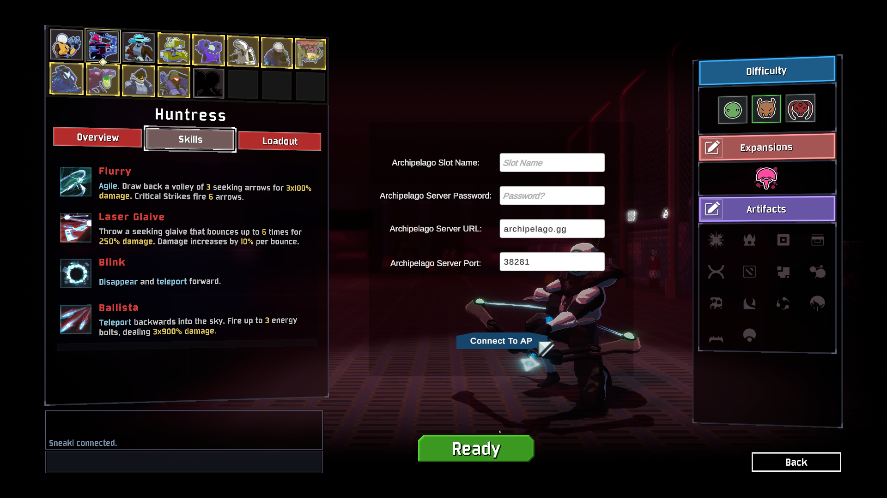

# Archipelago.RiskOfRain2 | 

This mod adds support to Risk of Rain 2 for playing as an Archipelago client. For more information on Archipelago head over to https://archipelago.gg or join our Discord.

Should be multiplayer compatible. Be sure to scale up your YAML settings if you play in multiplayer. All players require the mod in multiplayer.


## Gameplay 

### Classic mode

Classic mode is the original way to play Archipelago in Risk of Rain 2.

The Risk of Rain 2 players send checks by causing items to spawn in-game. Currently, this includes opening chests, defeating bosses, using scrappers and 3D printers, opening lunar pods, and accessing terminals. 
An item check is only sent out after a certain number of items are picked up. This count is configurable in the player's YAML.

### Explore mode

Explore mode is an alternative way to play Archipelago in Risk of Rain 2.

The Risk of Rain 2 player sends checks from doing different actions such as opening chests, beating shrines, defeating scavengers, finding radio scanners, and finding newt altars.
These locations divided evenly across the different stages and can only be completed in their respective stages.

Environments will be in the item pool, and you will need to unlock them to progress towards your goal.


The rules for locations are as follows:
- Chest-like interactables will send a check when a certain number of chests are opened. Multishops are not chest, 
but lunar pods and void cradles are. Artifact of sacrifice will treat item drops like opening chests.
- Shrines will send a check when a certain number of shrines are beat. Rules for beating shrines are:
    - Altar of Gold is beat on purchase.
    - Shrine of Blood is beat on interact. Sending shrine as a check denies gold.
    - Shrine of Chance is beat on when rewarded. Sending shrine as a check denies the item.
    - Shrine of Combat is beat on interact.
    - Shrine of Order is beat on purchase.
    - Shrine of the Mountain is beat on defeating the challenge of the Mountain. Sending the shrine as a check denies the bonus item.
    - Shrine of the Woods is beat on the second and third purchases.
- Scavenger bags send checks when opened but do not grant items. Looping to the same environment will let you reopen the scavenger bag.
- Radio Scanners can be found on every stage and send a check. Radio Scanners are guaranteed to spawn.
- Newt Altars send checks when found but do not grant a Blue Portal (Refunds 1 lunar coin). Newts Altars grant portals when the checks are depleted.

Explore mode also attempts to help against being stuck in RNG hell; the teleporter will favor environments that have more checks remaining.


### Achieving Victory or Defeat

Achieving victory is defined as beating Mithrix, or beating the voidling (DLC enabled). (This is both true for Classic and Explore modes.)

Alternatively you can change the Final Stage Death is Win setting to enable Obliteration ending as well as if you
die in the Commencement map (the moon). 

Due to the nature of roguelike games, you can possibly die and lose your place completely. This is mitigated partly by the free grants of `Dio's Best Friend`
but it is still possible to lose. If you do lose, you can reconnect to the Archipelago server and start a new run. The server will send you the items you have
earned thus far, giving you a small boost to the start of your run.

## YAML Settings
An example YAML would look like this:
```yaml
Risk of Rain 2:
  progression_balancing: 50
  accessibility: items
  goal: explore
  total_locations: 145
  chests_per_stage: 10
  shrines_per_stage: 5
  scavengers_per_stage: 1
  scanner_per_stage: 1
  altars_per_stage: 2
  total_revivals: 10
  start_with_revive: 'true'
  final_stage_death: 'false'
  environments_as_items: 'true'
  begin_with_loop: 'false'
  dlc_sotv: 'false'
  death_link: 'true'
  item_pickup_step: 1
  shrine_use_step: 0
  enable_lunar: 'true'
  item_weights: default
  item_pool_presets: 'false'
  green_scrap: 16
  red_scrap: 4
  yellow_scrap: 1
  white_scrap: 32
  common_item: 64
  uncommon_item: 32
  legendary_item: 8
  boss_item: 4
  lunar_item: 16
  void_item: 16
  equipment: 32
description: 'Risk of Rain 2 explore yaml'
game: Risk of Rain 2
name: Sneaki{player}
```

| Name               | Description                                                                                                                                                                                                        | Allowed values                                                                   |
|--------------------|--------------------------------------------------------------------------------------------------------------------------------------------------------------------------------------------------------------------|----------------------------------------------------------------------------------|
| total_locations    | The total number of location checks that will be attributed to the Risk of Rain player. This option is ALSO the total number of items in the item pool for the Risk of Rain player.                                | 10 - 250                                                                         |
| total_revivals     | The total number of items in the Risk of Rain player's item pool as a percentage of total items (items other players pick up for them) replaced with `Dio's Best Friend`.                                          | 0 - 10                                                                           |
| chests_per_stage   | The total amount of chests per stage.                                                                                                                                                                              | 2-20                                                                             |
| shrines_per_stage  | The total amount of shrines per stage.                                                                                                                                                                             | 2-20                                                                             |
| start_with_revive   | Starts the player off with a `Dio's Best Friend`. Functionally equivalent to putting a `Dio's Best Friend` in your `starting_inventory`.                                                                           | true/false                                                                       |
| item_pickup_step    | The number of item pickups which you are allowed to claim before they become an Archipelago location check.                                                                                                        | 0 - 5                                                                            |
| enable_lunar        | Allows for lunar items to be shuffled into the item pool on behalf of the Risk of Rain player.                                                                                                                     | true/false                                                                       |
| item_weights        | Each option here is a preset item weight that can be used to customize your generate item pool with certain settings.                                                                                              | default, new, uncommon, legendary, lunartic, chaos, no_scraps, even, scraps_only |
| item_pool_presets   | A simple toggle to determine whether the item_weight presets are used or the custom item pool as defined below                                                                                                     | true/false                                                                       |
| custom item weights | Each defined item here is a single item in the pool that will have a weight against the other items when the item pool gets generated. These values can be modified to adjust how frequently certain items appear  | 0-100                                                                            |


## Connecting to an Archipelago Server

I assume you already have an Archipelago server running. Instructions on how to run a server are available on https://archipelago.gg.

Fill in the relevant info and click `Connect To AP` to connect to the server

Keep password blank if there is no password on the server.



Once connected it will print in chat that you have successfully connected!

## Changelog
Internal versions are unreleased versions of the mod. They are pointed out in the changelog so that I can sort my work and to allow others to follow my progress between releases.

**1.2.0**

* Created Explore mode!
* Added Void Items (with DLC enabled)
* Added DeathLink support (Will send a death link for any player connected, and all players will die if receiving a death link while playing co-op)
* Added Environments as items
* Added Release/Collect prompt on goal completion
* Added ability to hide connect fields
* Update MultiClient.Net to 4.2.2
* Change Default URI to archipelago.gg
* Added Disconnect console command (`archipelago_disconnect`)
* Added Deathlink console command (`archipelago_deathlink true`)
* Changed Connect console command to (`archipelago_connect <url> <port> <slot> [password]`)
* The chat for items sent/received are more colorful


* Bug fixes:
  * Reduce chat lag on collects
  * Fixed a disconnect bug where it was being called twice.

**1.1.5**
* Fixed Fields resetting to default after dying.

**1.1.4**
* Fixed Collect Bug.
* Skip collected checks, so you don't just send nothing.
* Now connect to AP through lobby instead of with ready button.
  * Chat enabled for single player
* Added Color to Players in chat for better readability.
* Multi Client 4.0 support.
* Original mod location https://thunderstore.io/package/ArchipelagoMW/Archipelago/

**1.1.3**
* Fixed connection issues.
* Update client protocol version. 
    * Now only works on Archipelago server version 0.3.4 or higher.

**1.1.2**
* SOTV Ending now counts as an acceptable ending.
* Added YAML toggle for 'Death on the final stage counts as a win'.

**1.1.1**
* Update plugin version so it appears properly in the logs.

**1.1.0**
* Update to support Survivors of the Void DLC and updated R2API.
* Fix Archipelago PrintJSON packets.

**1.0.2**

* Update supported Archipelago version to function on current AP source.

**1.0.1**

* Fix chat box getting stuck on enabled sometimes.
* Stop lunar coins, elite drops, artifacts, and artifact keys from counting towards location checks.
    * Enables going to Bulwark's Ambry while you have location checks left.
* Names not appearing in multiplayer fixed.
* Fix lunar equipment grants not previously working.

**1.0 (First Stable Release)**

* Release of all changes from 0.1.5 up to 0.1.7.
* This version purely denotes a release, no new features or fixes were made.

**0.1.7 (Internal Version)**

* Allow for obliteration or fealty endings to work as AP session completion events. You don't _have_ to go to commencement anymore.
* Fix bug with objective display being wrong after game re-make.
* Fix bug with location check progress bar doubling on clients that are not the host.
* Fix bug with location check progress bar not working after reconnect. todo
* Chat messages from players who are not host now send to the multiworld correctly. (But under the name set in the YAML as it's only one slot for the whole RoR session)
* Remove location check progress bar from UI when all checks are complete.

**0.1.6 (Internal Version)**

* UI code refactor. Not visible to users, but code is slightly cleaner.
* Add `archipelago` console command. Syntax: `archipelago <url> <port> <slot> [password]`
* Reconnect logic is greatly improved. Now attempts to reconnect every 5 seconds for 5 tries. If it fails entirely, you can use the archipelago command.
* Your existing equipment drops at your feet when you are granted one from the server. The new one swaps into the slot.
* Add objective tracker for total number of checks remaining.

**0.1.5 (Internal Version)**

* Chat messages go out to the multiworld now.
* Smoke effect now appears when an item drop is turned into a location check as a visual indicator of sending out a check.
* Remove `total_items` YAML option as it doesn't work as intended.
* Other formatting tweaks to README.
* Add HUD for location check progress. Now appears as a bar under your health bar. When it fills up all the way it will reset and you will send out a check.

**0.1.4**

* Update `Newtonsoft.Json.dll` to the correct version, this fixes the client failing to connect to the server.

**0.1.3**

* Set InLobbyConfig as hard dependency.
* Update README to reflect that all players require the mod at the moment.
* Add `total_items` YAML option to README.
* Add `enable_lunar` YAML option to README.

**0.1.2**

* Add R2API as a dependency.

**0.1.1**

* Fix victory condition sending for commencement.
* Remove splash+intro cutscene skip (was for debugging purposes).

**0.1.0**

* Initial version.

## Known Issues

* Splitscreen support is unlikely at the moment. It might work, it might not.
* Connecting to multiple slots on the same multiplayer game will not work and will take just the hosts slot once in game.
* If you start a new run but join an existing AP session, you will get spammed with notifications for all your pickups.
* Game hitches upon someone forfeit/releaseing their items.

## To-do/Ideas

* Cache and load data package from file system.
* Further randomization in some way. Mob spawns, elite types, variance api, boss types, mob families, mobs with items, etc.
* More item/reward types: money, exp, warbanner drops, drones
* Funny/joke item types: launching you into the air, switch left and right click
* Trap item types: spawn a family of mobs on you, spawn bosses, drop bombs on the stage
* Randomize order of check sending.
* YAML options for types of item drops? Chests/Scrapper/Multishop/Boss/LunarCoin/GoldChests
* Add objectives so that certain number of checks per level required per portal
* Randomize pickup step every stage or every check?
* Prevent game over if dios still present in item pool.
